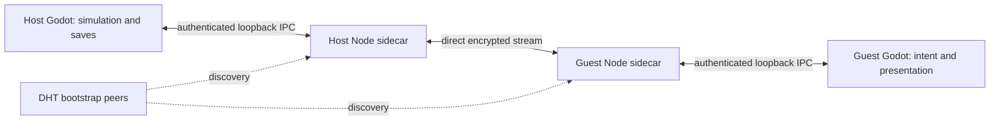

# Co-op architecture

## Implemented scope

The existing adventure supports a solo host with up to three joining friends: the shared pod escape, movement, knife/fist/soybean-gun combat, directional guarding, dropped-knife recovery, damage/respawn, mobs, dummies, harvesting, healing pickups, discoveries, EXP and day/night. Guests can join during play and rejoin their saved character. The host saves the party and world. Offline play remains independent of the networking runtime.

Discovery is opt-in through **Discover testers**. Compatible testers share `tofufu-adventure/public-playtest/v2`; up to 32 reachable peers appear in the lobby. Hosts accept three guests, without accounts or invitations. A public topic is not a tester allowlist. Restrictive networks can prevent a direct connection.

## N1 — Direct connectivity and a local runtime (implemented)

Pinned Hyperswarm 4.17.1 runs in Node.js 22+. The parent passes an OS-assigned loopback port, fresh random capability and local identity-file path over inherited stdin. The Godot adapter owns startup deadlines, polling and child retirement. No capability is placed in command-line arguments. Offline startup spawns no child; leaving discovery closes it. Desktop exports use the staging helper described in `networking/README.md`.

The sidecar persists a random 32-byte identity seed in the game's user directory, with owner-only permissions on POSIX. Encrypted connection keys identify members; names are display labels. Reusing the profile retains the character identity across restarts. Corrupt identities produce an error instead of silently replacing the key. Copies of one profile must not run simultaneously.

This project's direct-only policy uses `relayThrough: () => null` in the pinned implementation. DHT/bootstrap peers provide discovery, but no automatic gameplay payload relay is selected. Initial discovery refresh and subsequent 20-second refreshes handle simultaneous starters. Handshakes and heartbeats expire silent connections. Transport behavior is based on the pinned source and [Hyperswarm's API](https://github.com/holepunchto/hyperswarm); keyed connectivity and hole punching are provided by [HyperDHT](https://github.com/holepunchto/hyperdht). Neither library guarantees connectivity through every NAT.

## N1a — Replaceable transport backend (implemented)

`networking/godot/SessionTransport` is the abstract Node contract for discovery, authenticated reliable ordered packets, and resource lifecycle. `HolepunchTransport` implements it. `game/app/launch.tscn` selects the concrete transport child through the launch script's exported `transport` reference. `SessionConnection` wires it to `PlaytestRoom` and owns discovery/disconnect/shutdown composition. The launcher, room, gameplay and lobby scripts do not construct or reference Holepunch. Backend descriptions are supplied as display data to the lobby.

The contract has `start(display_name)`, `send_packet(key, data)`, idempotent `close()`, `is_closed()` and awaitable `shutdown()`. Constructing/adding a transport must not connect or spawn anything; discovery is explicit. `start` replaces an old connection, and `close` immediately stops its delivery/events while retiring resources. Implementations must bound startup, connection and retirement time, finish cleanup even while menus are open, and clean up on tree exit. `shutdown` waits for `is_closed`, so an implementation must enforce its own retirement deadline. Reopening must not deliver events from a previous connection. `SessionConnection` clears room discovery state on disconnect; leaving a meadow alone keeps discovery available.

The `event_received(Dictionary)` schema intentionally retains the existing bounded JSON value protocol:

| Event type | Required values | Meaning |
| --- | --- | --- |
| `ready` | `key`, `name` strings | Local authenticated identity is available |
| `searching` | none | Discovery is active |
| `peer` | `key`, `name` strings | Authenticated remote endpoint can receive packets |
| `left` | `key` string | Remote endpoint disconnected |
| `packet` | `key` string, `data` dictionary | Message bound to its authenticated sender |
| `error` | `message` string | Terminal backend failure; adapter closes resources before emitting |

Adapters must validate external data, emit `ready` before peers, announce a peer before its packets, and never accept a sender identity supplied by an untrusted payload. Delivery is reliable and ordered per endpoint; payloads remain bounded to the existing 64-KiB envelope and queues/rates remain bounded. Identity is a stable lowercase 64-character hexadecimal application ID, as required by current room, chat and checkpoint schemas. Holepunch uses its encrypted public key. Another backend must authenticate and consistently map its account IDs to this representation; display names are never identity. Existing character saves require an explicit trusted identity migration if the mapping changes.

To replace Holepunch, implement this contract under `networking/` and change the transport child script/configuration in `launch.tscn`. Endpoint URLs, credentials, SDKs and service-specific discovery belong in that adapter, not in room rules or views. A centralized directory/message service can expose the same authenticated endpoint semantics and reuse the current presence/join/roster/gameplay protocol. A production centralized adapter, authentication flow, service deployment and identity migration are **planned, not implemented**. No centralized connection or automatic fallback is enabled by this boundary.

Transport replacement does not relocate authority: one participating player still simulates and saves the world, and host loss ends play. Dedicated server simulation, server-owned matchmaking/admission or cloud saves require separate explicit changes to `PlaytestRoom`, app authority composition and persistence. They must not be hidden behind a packet transport. Holepunch's current direct-only policy continues to apply to its adapter; selecting a future centralized backend must be deliberate.

`tests/test_session_transport.gd` supplies an alternate local implementation and exercises discovery, admission, gameplay delivery, reconnect, host loss, errors, delayed cleanup and actual launch-scene injection without Node or the network. The architecture checker prevents concrete Holepunch dependencies returning to game scripts.

## N2 — Session, authority and composition (implemented)

`PlaytestRoom` owns presence, build/protocol compatibility, capacity, host-issued roster, room epoch, join/start/leave and host-loss behavior. Only the host's roster admits actors. A host can start exploring with no guests and remains discoverable. Unexpected host disconnection or an interrupted join retains the selected host for a bounded 20-second retry window; rediscovery permits a new join request every two seconds. Explicit leave/rejection cancels retry, and expiration reports an actionable message. Rejoining reconstructs the guest scene from host state; it does not migrate authority. A guest sends ready after composing its scene; a valid complete world snapshot enables its input. Join-in-progress uses the same path. Leaving guests are removed from active simulation, while their character checkpoint remains available for rejoining. A world retains at most 32 character identities.

`app/CoopSession` composes `CoopRoster`, `CoopActor`, `CoopOpening`, `CoopWorld` and `CoopEncounters`. These app objects connect independent features; movement rules never read networking. The host executes every actor's commands through the existing movement, equipment and collision rules. Mobs choose the nearest eligible party member; pickups select one nearby collector, healing that character and awarding shared progress exactly once. Soybean guns have friendly fire: app composition injects every other live party health receiver into each gun, excluding its owner. The host sweeps projectile segments against world and actor colliders, applies 20 body or 40 upper-region damage, and existing health/respawn snapshots replicate the outcome. Knife/fist target lists retain their prior PvE behavior. Living players and snails block one another through their physics capsules on the host, including dashes. Shared collision-aware player placement prevents occupied joins, respawns and checkpoint restores; hidden pod participants disable their actor layer until revealed. Guests continue displaying authoritative state rather than deciding collision outcomes.

Guests disable actor, encounter and quest outcome simulation. They interpolate host actor states, apply world state, and present sword swings, guarding, punches, dropped knives, health and respawns. Each guest retains its own camera and HUD. All players may contribute to the shared opening; the host alone advances the pod rules and broadcasts the cinematic state. During online menus the world continues and local input is neutralized. Host departure ends the session; it does not elect another authority.

## N3 — Bounded protocol (implemented)

Both streams use a four-byte big-endian JSON length, maximum 64 KiB per frame. Incremental decoding handles fragmentation/coalescing, rejects malformed frames and caps buffers at 256 KiB. Peer framing limits message rates and uses explicit queued-byte accounting plus a three-second stalled-write deadline. Loopback Node streams complete writes through callbacks; encrypted streamx peers use `Writable.drained()` because their `write()` does not accept a callback. Completed writes release queued bytes and cancel the stall deadline on both paths. Handshake version/build and session epoch reject incompatible or obsolete traffic. Sender identity comes from the encrypted stream, never from an input field.

`ExplorationProtocol` validates finite bounded vectors, booleans, integer counters and actor/combat records. `WorldProtocol` validates the fixed-content world and opening records. No remote object or Resource deserialization is used. `InputWindow` rejects duplicate/replayed inputs, future acknowledgements, acknowledgements over 180 host ticks old, sequence leaps over 240 and input rates over 90 per second. Remote queues hold at most 12 commands. Each host tick consumes the newest held intent and coalesces queued one-shot actions once, so different peer tick rates do not accumulate simulation debt. Overflow discards stale actions and cancels the current charge instead of removing the member. Packet validation and rate limits still apply. Held intent expires after 250 ms, cancelling pending charge instead of synthesizing an attack or jump release.

Host physics and guest intent run at 60 Hz, actor snapshots at 20 Hz and full world state at 10 Hz. Snapshots carry acknowledged host ticks through subsequent guest inputs. World records include 15 mob slots (nine regular and six rain-only), 24 harvestables, three dummies, up to 128 pickups, environmental phase, weather phase and shared progress. Opening state accompanies each snapshot. Guests discard old snapshots and time out when the host stops responding.

Reliable streams can delay newer data behind older data. There is no client prediction/reconciliation or deterministic lockstep. These rates and limits are project choices; different machines are not expected to simulate identical Godot physics.

Weather is host-owned: guests apply the normalized `weather_phase` before mob records and disable their weather clock, including after the opening. Rain health modifiers and reserve availability are derived from that state; repeated snapshots do not multiply stats or produce loot. Rain presentation remains local. Live lobby join version 5 requires the current gun, weather and proximity-chat protocol. Legacy saved worlds with nine records and no weather remain readable as clear weather; existing checkpoint version numbers are retained.

## N4 — Host-owned persistence (implemented)

`CoopCheckpoint` stores a validated version-2 co-op payload inside the existing atomic adventure record: world state, opening stage/timing and per-character state keyed by persistent peer identity. `SaveStore` receives a value validator from app composition, preserving its feature boundary. The whole record is bounded to 64 KiB.

Co-op saves retain health, position, equipment/dropped knives, encounters and their timers, outstanding loot, EXP, discoveries and unfinished pod progress. Per-character EXP and partial fist, sword, defence, magic and attack-speed practice persist alongside actor state. The host alone awards training and shares each enemy EXP reward once among active characters. Actor snapshots carry validated progression values; world EXP application never awards character EXP. Existing saves without progression migrate characters from the saved world EXP with fresh level-1 skills. Hosting a solo save retains its character progression; unrelated hosts do not exchange portable character profiles. Transient attacks and dashes are cancelled safely when restoring. Autosave runs every minute; manual save, return and quit also save on the host. Guests do not write the host world. Continue routes shared saves to the lobby's adventure selector. Existing solo checkpoints remain compatible; their simpler encounter-reset semantics are unchanged. Clearing the local identity file loses automatic association with the old character.

## Verification and remaining limits

`python3 tools/verify.py` exercises protocol guards, four-player capacity, replay/rate limits, held-input cancellation, two-world combat/loot/respawn, JSON-wire quest progress, disk checkpoints, actual launch/continue flow and host loss. `npm test --prefix networking/sidecar` covers local encrypted discovery, healthy connections beyond the three-second write deadline, streamx completion and real stalls, framing/backpressure, identity persistence and shutdown. Two-process checks run a 30-Hz host against a 60-Hz guest and fail on any unrequested guest session end, so reconnects cannot hide a dropout.

`python3 tools/verify_coop.py` runs separate Godot processes and real sidecars against an isolated local DHT, then verifies combat, pickup healing, drop/recovery, disconnect/rejoin identity, host saving and child shutdown. `--public-network` has also passed through the public DHT on a separate random verification topic. Both runs used one macOS computer; distinct physical networks/NATs, multi-OS exports and physical controller hardware remain unverified. Godot-rendered host/guest and menu previews cover presentation separately.

Host migration, client prediction, generalized inventory and replicated save ownership are not implemented. Shops, interiors and Mayor quests remain base-game placeholders. Desktop runtime staging is supplied; mobile sidecar integration and platform signing are not supplied by this change.

## N5 — Proximity text and voice (implemented)

`app/ProximityChat` connects `chat/` rules and views to explicit actor handles and the existing room transport. The host selects recipients from current authoritative X/Z positions: normal text and voice reach 12 units; yelling reaches 36. Elevation and walls do not reduce range. Text and voice from guests first travel to the participating host, who forwards only to eligible party members using existing direct peer connections; there is no additional service or automatic network relay.

Enter opens the composer and submits; Escape cancels before reaching the pause menu. The megaphone button toggles yell for the next message and resets on close. Recipients see six-second outlined overhead text, gold for yells, and a scrollable 50-message plain-text history above the health bar. History records messages heard at delivery time and stays when walking away; it is cleared when leaving the adventure and is never checkpointed. New arrivals do not receive old history. Typing neutralizes local commands and cancels pending jump/combat charge. Menus hide the chat composer and suppress transmission. The controls guide starts collapsed; Tab / Select opens it in the center to leave the history visible.

Both packet kinds carry the existing room epoch and a monotonic sender sequence. The host binds identity to the authenticated incoming peer, discards supplied sender/position fields, sanitizes text, and constructs delivery records. Text is limited to 240 characters and one message per 700 ms per sender. Voice admission permits ten 100-ms chunks per second with a three-chunk burst allowance. Guests accept deliveries only from their host and reject replays without dropping legitimate coalesced deliveries. Departure clears rate, sequence, speech and playback state. Live join version 5 excludes earlier clients; checkpoint versions are unchanged.

Microphone transmission defaults off. In co-op, enable **Mic**, then hold physical **V**; release, typing, an open menu or lost window focus stops capture/transmission. **Listen** mutes incoming voice. Godot's default input device feeds an isolated muted capture bus; local microphone audio never plays through the speakers. Each 100-ms frame is downsampled to 16-kHz mono signed 16-bit PCM, base64 encoded, and strictly validated before decoding. Each recipient has at most three playback streams with 300-ms buffers; inactive streams expire after 400 ms and leaving voice range immediately discards their queued playback. Local playback volume falls linearly with planar distance. Capture backlogs are dropped. No voice is written to disk.

Audio uses Godot's [microphone stream](https://docs.godotengine.org/en/latest/classes/class_audiostreammicrophone.html) and capture/generator APIs. Project audio input is enabled; OS microphone permission is still required. The macOS preset includes the [audio-input entitlement and usage description](https://docs.godotengine.org/en/latest/classes/class_editorexportplatformmacos.html#class-editorexportplatformmacos-property-codesign-entitlements-audio-input). Microphone selection follows the OS default. Mobile co-op remains unsupported.

This is a basic PCM voice implementation, without Opus compression, echo cancellation, noise suppression, per-player mute or spatial panning. Use headphones for microphone playtests. Voice shares the existing reliable stream, so congested connections can delay audio and gameplay. Automated tests cover synthetic PCM conversion, playback creation/removal, microphone-bus lifecycle without recording, distance routing, malformed traffic, replay/rate limits, input gating, expiry/history bounds and two-world text delivery. Godot-rendered host/guest previews cover presentation. `tools/verify_coop.py` also passed with separate Godot processes and real Holepunch sidecars against an isolated local DHT, including text delivery, synthetic voice reaching playback, disconnect/rejoin, saves and shutdown. Physical microphones, audible end-to-end quality and separate-network voice calls remain unverified.

## N6 — Soybean firing intent and presentation (implemented)

Slot 3 is the fixed soybean gun. Input carries a finite world aim point bounded to 500 units per component plus existing attack and guard booleans; guard means precise aiming with this slot. The host owns the offset muzzle, 55-unit/second velocity, 0.18-second cadence, recoil bloom, random spread, swept collisions and damage. The actor-to-muzzle segment is checked before flight so cover cannot be bypassed. Cosmetic beans start at each viewer's billboard barrel and converge onto the authoritative path. Clients never supply a hit, victim, damage amount or muzzle. Own-body collision is excluded; walls absorb beans before a target behind them. Invulnerability and existing depleted/respawn behavior still apply. Guns do not award sword/fist practice.

Actor combat snapshots include gun/aim state, bounded recoil heat, a shot counter and bounded last-shot origin/velocity. Guests may spawn cosmetic beans for newly observed counters, but never run their damage path. Reliable-stream stalls can omit intermediate cosmetic shots; authoritative health remains the result. Active projectile flight is transient and is not checkpointed. Gun selection is checkpointed; old saves default to their previous knife/fist selection. Camera mode, orbit and reticle remain local and are not sent to other peers.

Tests cover host-to-guest headshots and guest-to-host body hits over the existing two-world JSON fake transport. Physical cross-network gun feel has not been verified.
