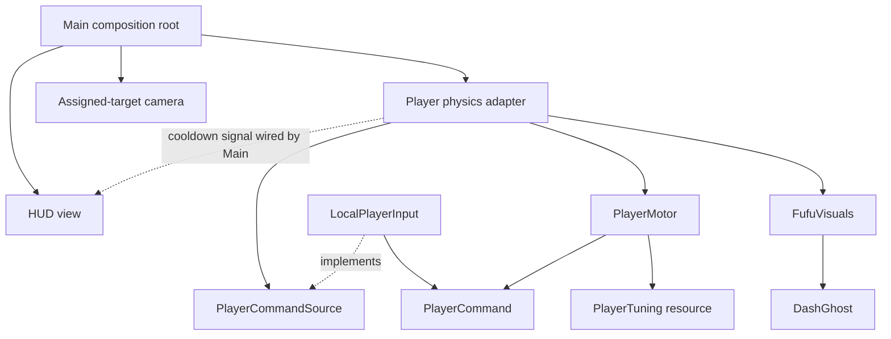

# Architecture

## Status and scope

Implemented: a modular offline exploration sandbox with billboard actors/items, 3D scenery, charged melee, renewable harvestables, Edamame ground pickups, roaming snails, super jumps, a river, and a day/night cycle. Original walk/dash rules and Fufu art remain. Implemented additionally: title/pause menus, local adventure checkpoints, device preferences, and a Holepunch lobby with host-authoritative shared exploration, combat, opening quest, progression and host-owned checkpoints. This document records project decisions, not claims that future systems already exist.

## A1 — 2.5D means 3D simulation, 2D character presentation (accepted)

Use Godot 4.7, typed GDScript, Jolt and a fixed 60 Hz physics tick. X/Z form the ground plane; Y is height. CharacterBody3D owns movement/collisions. Sprite3D owns appearance, with a tilted perspective camera. Keep the existing full-billboard default; orthographic projection or fixed-Y billboards are art choices that must not alter world coordinates. Collision layer 1 is World, layer 2 Actors. Players and living snails use World + Actors (mask 3): player/player, player/snail and snail/snail movement blocks through their existing capsules, including dash and knockback sweeps. Actors only inherit platform motion from the World layer. Jumping over another actor remains possible once their physical heights clear.

The source art's side row faces left. The idle/walk pixel sizes deliberately differ to preserve visual scale. Keep body scale at one and animate only the sprite. The separate `GroundShadow` component projects a landing cue onto the world.

## A2 — Feature modules with explicit composition (accepted)

Dependency direction: composition may know features; features know their own types and small explicit contracts. Movement rules depend only on value/configuration types and Godot math, not the scene tree. UI takes display data. App composition translates protocol messages to commands without inserting sockets into movement rules.

Use ordinary Godot objects and scene composition. There is no DI container, global event bus, singleton registry, generic repository layer, or universal Entity base class. Prefer one coherent implementation until a real alternate consumer justifies a contract. The command-source contract already has a useful neutral implementation for tests and a local-input implementation.

## A3 — Intent, simulation and appearance are separate (accepted)

Each physics tick: sample one fresh PlayerCommand; update the per-player PlayerMotor using velocity, grounded state and delta; apply its returned velocity through move_and_slide; present state and emit cooldown data. A command is an in-process value, not a wire-format object. Each motor holds its own timers; tuning may be shared read-only.

Motor jump/dash signals drive presentation. Effects never determine hits, cooldown completion, or movement. The player coordinator owns engine physics; the motor owns movement rules. Combat lives in `game/combat/`: `MeleeRules` owns charge/cooldown, `Damageable` owns per-instance health, and `PlayerCombat` resolves swept blade-box overlaps against real colliders and checks world occlusion on the physics tick. `TrainingMob` and `HarvestProp` compose damage receivers; `SoybeanPickup` emits collection. Avoid extending the movement object into an all-purpose actor brain.

The initial refactor preserves coyote time, buffered jump, faster falling, dash cooldown, and the trigger-tick dash order. Ghost timing now uses elapsed time, and ghost transforms are assigned after attachment to avoid parent-transform errors. Camera smoothing uses an exponential factor. HUD dependencies are explicit and zero-length cooldowns are supported.

Snail mobs use `SnailVisuals` for five-frame idle, walk and attack atlases, mirroring side views into eight directions. Source sheets are preserved under `assets/characters/snail/source/`. The HUD owns a 1.6-second refractive slime stroke; app damage feedback triggers it only for local slime hits. Replicated per-source hit counters also preserve fatal-hit feedback across immediate respawns; soybean-gun hits use a brief amber impact instead. Presentation never applies damage or changes attack timing.

### Eastern jungle (implemented)

Jadewild extends the farm east through a signed pass at X=41, Z=26. `JungleWorld`, `JungleTerrain` and `JungleProps` own continuous collision terrain, palms, ferns, ruins and a decorative waterfall basin. There are no jungle encounters or interactive objects. Collision layer 8 is reserved for the entrance barrier; `ActorProgression` enables its mask only below character level 8, independently for each offline, authoritative and predicted actor. Existing replicated progression supplies the level; no new network payload is needed. Tall perimeter barriers prevent jumping around the pass. The map includes the extension.

### Exploration sandbox composition (implemented)

`main.tscn` instances `world/meadow.tscn`; the world owns terrain, bridges, 3D decoration and environmental presentation. `Meadow` uses a fixed decorative seed. World materials use soft toon diffuse lighting, restrained highlights, mint foliage, peach blossom clusters and turquoise water to complement the billboard character art. The rounded ink-and-mint HUD presents equipment state. `EnvironmentCycle` changes lighting over 180 seconds, with readable ambient night lighting and fireflies. The shallow river has a real lower collision bed and three flush crossings.

`app/main.gd` translates `Player.command_sampled` into the combat component's aim/held values, wires HUD data, manages safe player respawn, and assigns a surface speed multiplier for wading. Movement rules never query the world or combat. `SandboxEncounters` explicitly creates and registers damage receivers, assigns the player to snails/pickups, and connects damage, loot and healing signals. `ExplorationSites` tracks four in-session discoveries. There are no global registries or scene searches.

LMB charges/releases knife attacks; RMB holds a 110-degree forward knife guard. `ActorLoadout` connects inventory equipment to combat: two combat slots selected by 1/2 hold real knife, soybean gun or Soyjet item stacks; empty slots use fists. F punches with either slot. Q drops the active item and E picks up the highlighted visible item. Pickups fill an empty combat slot or enter the bag. Four support slots below the worn equipment use keys 3–6. Equipment, active slot and item reserves persist in checkpoints; legacy weapon ownership migrates into slots and bag, with overflow retained for safe world drops. Kaji trades combat equipment for Mature Beans through `WeaponTrade`. Currency is never a healing item or support-slot item. Jump now loads on the ground while held and launches on release. A 0.65-second hold reaches twice the normal height using a square-root launch-velocity multiplier. Gravity is 40 with a 1.65 falling multiplier for a faster, heavier arc. Midair holds cannot add lift; leaving the coyote window or dashing cancels charge. The HUD displays charge and readiness. Moonwatch has an intermediate 3.1-unit ledge so two charged leaps reach its roof. The ordinary jump buffer, coyote time and dash order remain. Combat visuals and the ground shadow are presentation only. Snails telegraph attacks and can be interrupted or dodged; they wander locally with collision steering, without a navigation mesh. Crops/props regrow after 28 seconds and snails respawn after 22 dry seconds (eight in rain). Edamame ground drops persist until proximity collection can add them to the backpack (100 per stack). Adventure checkpoints now persist progress totals; solo encounter and loot state resets on continue, while shared checkpoints preserve these states. See A5 below.

`FufuJumpAnimation` selects the supplied ten front-facing textures from vertical velocity, ground clearance and actual contact, then plays impact/rebound/settled recovery. The physics adapter supplies a downward ground ray only during falling; presentation does not alter the collider or velocity. Per-frame feet and hand landmarks keep the art and held knife aligned. The original front poses are retained. `DirectionalJumpArt` now supplies the seven other views through four generated ten-phase rows and mirrored E/SE/NE variants; directional idle/walk resumes after landing.

`FufuChargeAnimation` presents the separate user-supplied six-frame grounded charge-walk sheet. AtlasTexture regions omit printed labels. Actual poses map its rows to SW, S, W and N; E/SE mirror W/SW. NW/NE retain existing rear-diagonal art. Actual walking cycles all six frames; stopped or blocked charging uses frame zero and follows aim, with existing attack-facing priority. Foot and hand landmarks follow each cropped frame, including mirroring. This presentation replaces the frontal takeoff pose only while grounded charging; airborne phases and all movement rules are unchanged.

### Actor placement and blocking (implemented)

`PlayerPlacement` checks world/actor capsule occupancy before spawn, respawn and checkpoint teleports, trying nearby grounded positions when occupied. App composition injects explicit live actor handles so simultaneous teleports also see positions not yet synchronized into physics queries; there is no global actor registry. Departing party members leave that list. Living snails delay respawn until their home capsule is free, while dead/dormant snails retain collision layer zero. Hidden pod participants disable their actor layer until the opening ends. Co-op host movement resolves all collisions; guest interpolation remains presentation of host positions and can show temporary positional differences under latency.

### Weather and rain populations (implemented)

`world/WeatherCycle` advances a separate 180-second normalized clock on physics ticks: clear, a 25-second windy spell, overcast, 60 seconds of rain, overcast, then clear. The opening pauses it, solo pause follows the scene tree, and guests never advance it. `app/WeatherFlow` translates condition changes into encounter modifiers, cloud cover for `EnvironmentCycle`, and values for `ui/WeatherView`. `WindField` deterministically eases its heading throughout each windy spell from the replicated weather phase; grass and the HUD gust overlay use that value, while the player adapter applies a bounded headwind multiplier. Rain is a local animated screen overlay behind the HUD; sky, sunlight and fog blend into overcast conditions. It is a bounded repeating cycle, not a meteorological simulation; rain has no world collision or shelter occlusion.

The original nine snails retain stable indices, followed by six dormant rain-only slots (two per camp). Rain enables those reserves after eight seconds and accelerates all pending respawns proportionally: 22 seconds dry, eight in rain. Snail tuning defines 60/90 maximum HP and 12/18 attack damage for dry/rain. Weather transitions preserve the living health fraction and never heal dead mobs, award loot, or reset respawn progress. On clearing, reserves become hidden, non-colliding and non-damageable without rewards; the original nine return to dry strength. Damage, loot, telegraphs, village exclusion and authoritative combat stay in their existing features.

Solo saves add optional `weather_phase` and retain the existing encounter-reset behavior. Co-op world snapshots/checkpoints include weather and all 15 slots. Old records without weather restore clear skies and nine original mob records, leaving reserves dormant. The live lobby join version is 4 for weather and proximity chat; checkpoint versions remain unchanged with explicit legacy validation.

### Soybean pod opening (implemented)

New sessions begin with a retryable escape quest. `PodEscapeRules` owns four alternating, timed directional pushes, a 0.55–0.82-second hold/release to snap the stem, a 0.9-second authored fall, a second timed release to split the seam, and a three-second world reveal. It accepts primitive intent values and elapsed time; it never reads Input or scene nodes. Misses retain completed steps. `SoybeanPlant` constructs the trifoliate nursery plant, cutaway shell and occupant marker and presents supplied motion values.

`app/pod_opening.gd` samples the existing command source while the actor's normal physics tick is disabled, positions the existing billboard at the pod's marker, and composes the rules, plant, quest HUD and camera. App wiring suspends encounter simulation and discovery, hides combat/HUD presentation, and gates camp/time shortcuts until escape. Completion restores ordinary movement, combat, exploration and camera framing; the open shell remains as decoration. The scripted fall and exit arc are confined to the authored clear starting location, not a general rigid-body pod simulation. Movement and combat feature boundaries are unchanged.

`PodQuestHUD` receives text and meter values; its screen effect softens peripheral scenery and fades during the camera pullback. Existing keyboard, gamepad and touch movement/jump actions feed the quest. `SoybeanPlant.occupant_offset` and `PodOpening.close_camera_offset` expose alignment/framing for replacement character art. New adventures and solo checkpoints saved before completing the opening replay the pod sequence; shared checkpoints resume its saved stage and timing. Completed openings stay complete when continuing. `Main.play_opening` defaults to true; sandbox-focused tests/previews explicitly disable it, while the dedicated opening test exercises the default entry sequence.

### Eight-direction sword and camera (implemented)

The default camera looks down at 45 degrees; C also selects the shoulder shooting view described below. Its look point follows the same smoothed position as the camera, preserving pitch while jumping and walking. Fufu faces the travel direction while walking and the mouse while idle or charging; active strikes temporarily lock presentation to the quantized attack direction. The original cardinal art is preserved. The user's original diagonal PNG supplies SE/SW/NE/NW frames with per-frame foot offsets; ghost sprites copy those offsets. All stationary directions use the user-supplied eight-pose idle atlas, with calibrated center and foot offsets. NE mirrors the actual NW idle cell because the supplied NE cell repeats the rear view. Walking requires actual horizontal velocity as well as movement intent.

`CombatTuning` defines a compact 0.65-unit steel blade, 0.12-unit width, grip, outboard hand radius and slash timing. `SwordGeometry` supplies the raised idle pose and a descending rotational cut in front of the actor. The hand travels around the outside of the body; steel points outward throughout wind-up, cut and recovery. `SwordVisual` maps each atlas view into the same pose and dimensions used by physics. Its authored 45-degree art plane keeps the flat weapon readable without using camera nodes in gameplay rules. The crossguard and grip do not deal damage.

For resting, walking and charging, `FufuVisuals` emits a source-pixel hand landmark transformed by the current frame, mirror, offset, scale and billboard plane, plus whether the hand faces the camera. The app connects this built-in-value signal to `SwordVisual`; there is no player/combat type dependency. The weapon's calibrated grip follows that hand, with the upright blade leaning outwards. S/SE/SW poses draw the knife slightly in front of the sprite to overlap the visible hand/body; other poses keep it behind the alpha-cut body to hide overlap. Normal world depth testing remains enabled. Harmless wind-up/recovery blend between this held pose and the authored slash. During the damaging cut, the displayed transform matches the physical blade exactly; hand/camera presentation never changes collision queries or damage.

Attacks have a harmless wind-up, a 130-degree cutting arc, and harmless recovery. Charged attacks use a wider 170-degree arc and more damage with the same blade size. `PlayerCombat` samples both actor translation and blade rotation on the physics tick, only during the cutting interval. It overlaps real target colliders, rejects occluded targets, and damages each receiver once per attack. `SwordTrail` draws a short ribbon behind the actual cutting blade without deciding hits. The app connects attack-facing data into player presentation and resets combat on respawn. F3 toggles an overlay of the active blade box. No new dependency from movement into combat or presentation was introduced.

### Local device inputs (implemented)

`LocalPlayerInput` translates keyboard/mouse, standardized joypad actions and touch actions into the same per-tick command. Analog travel magnitude is preserved; directional aim uses right stick, then travel, then last aim. Mouse activity restores pointer aiming. `TouchControls` emits built-in input actions and is composed by the app scene; it never reads actor state or decides outcomes. There is one local player; all pads share its action map. Controller ownership and local co-op are not implemented. Export baselines and platform limitations live in [PLATFORMS.md](../PLATFORMS.md).

## A4 — Player-hosted authority behind a replaceable transport (implemented)

See [COOP.md](COOP.md) before adding networking. One participating player's Godot process owns the session simulation. The launch scene injects a `SessionTransport`; `SessionConnection` connects its lifecycle and authenticated packets to room rules. Holepunch remains the default discovery/encrypted-connectivity adapter/runtime. An explicit Oracle client scene selects a TLS WebSocket adapter, and a separate dedicated server scene owns the simulation and saves without a host avatar (COOP N8). Holepunch remains available for comparison. See COOP N1a for the contract and migration limits. Local physics remains playable without that runtime. A fixed tick makes ordering explicit; it does **not** guarantee deterministic Jolt simulation across machines.

## Growth rules

| New responsibility | Owner when introduced | Boundary |
| --- | --- | --- |
| Session lifecycle, roster, entity IDs, command acceptance | `game/session/` and app co-op composition (implemented) | owns actors via explicit handles; depends on transport port |
| Combat and harvesting | `game/combat/` (implemented); weapon slots implemented | typed damage receivers, intent values and local signals |
| Inventory and equipment | `game/inventory/` (implemented); 10-slot bag, equipment slots, drag-drop window and gradual healing | typed item stacks, equipment constraints, narrow contracts |
| Saves | `game/persistence/` (implemented) | versioned value records, atomic writes; no node serialization |
| Holepunch and local bridge | `networking/` (Node sidecar implemented) | bytes + connection identity + lifecycle events |
| New levels | `game/world/` | data/scenes; reusable props stay separate |

Create these modules only as a vertical feature needs them. Keep the demo entry scene small as levels grow: extract authored environment into a level scene, leaving player/session/HUD wiring in app. A session object must coordinate lifecycle, not absorb transport parsing, persistence, movement or UI.

## Agent context strategy

Root AGENTS contains invariants and routes. Scoped files add only local rules. The map is the index; architecture docs are loaded on demand. Update maps/contracts in the same change as code, and keep verification commands runnable. Do not put historical logs, generated trees or all design rationale into root instructions.

Codex discovers instructions along its project-root/current-directory path; therefore root-started tasks are explicitly told to read the relevant child scopes. Source: [official AGENTS.md guidance](https://learn.chatgpt.com/docs/agent-configuration/agents-md) (checked 2026-09-07). This project does not change global Codex configuration or automatically launch agents.

## A5 — Frontend, checkpoints and opt-in co-op (implemented)

`app/launch.tscn` is the entry scene. It composes presentation-only `ui/menu/` views, the existing offline scene, settings/save flows and injected peer/dedicated transports selected explicitly in the lobby. `SessionConnection` retires and detaches the old transport before switching; selecting a mode alone opens no connection. The main gameplay scene remains independently instantiable for tests. Menus use the existing Fufu atlas with original mint, cream and ink vector scenery. Escape / controller Start opens the pause menu; solo pauses simulation, while online menus neutralize local intent without stopping the host world.

`SaveStore` bounds and validates version-1 JSON, writes a sibling temporary file, flushes and atomically renames it into one of 12 slots. A new adventure uses an unused slot; deletion requires an explicit confirmation. Autosave runs every minute and on save/return/quit. Saves contain name, timestamp, elapsed playtime, opening-complete flag, position, health, time of day, progress/EXP, discoveries and owned/selected/dropped knife. Solo checkpoints regenerate encounters and loot and restart an incomplete opening. Shared records add a validated version-2 payload retaining encounters, loot, exact opening progress and characters keyed by persistent peer identity. `AdventureSnapshot` and `CoopCheckpoint` translate scene objects to values; the store receives an injected co-op validator. Transient swings and dashes reset safely on restore.

`GamePreferences` persists window resolution/fullscreen, keyboard/mouse and controller bindings, and stick deadzone locally. Display changes require Keep within 15 seconds or revert. Fullscreen uses native display resolution. Escape/Enter/Start remain menu navigation keys. Stick movement is retained when remapping controller buttons. One local actor still owns all local devices. No runtime singleton or global event bus was added.

The public discovery lobby, full existing-game co-op and host-owned saves are described in [COOP.md](COOP.md). Offline startup does not spawn Node. Separate Godot clients have passed both isolated and public-DHT checks on one macOS computer. Distinct physical networks, other operating systems and signed exports remain unverified.

## A6 — Per-character skills and experience (implemented)

`progression/character_progress.gd` owns cumulative practice, character EXP and derived modifiers as per-instance values. `app/actor_progression.gd` connects confirmed combat events, applies primitive multipliers to combat and the movement motor, and supplies display data to the HUD. Combat, movement, presentation and persistence do not depend on progression types. Rules do not read Input or scene nodes; shared tuning resources remain unchanged.

All ranks start at 1 and cap at 99. Shooting gains one practice point per confirmed projectile hit on a trainable target, costs four times the melee practice curve, and adds weapon damage plus 0.6% spread reduction per rank (58.8% at cap). Attack-speed modifiers also accelerate gun cadence. Base fists repeat at 0.38 seconds, matching the basic sword swing. Fists and swords train separately: one point per attack that successfully damages a mob or dummy, regardless of target count. Misses, rejected hits and harvesting award no practice. Successful directional guards award one defence point; incoming damage and dodges do not. Dummies award no character EXP or loot. Magic advances only through positive mana actually spent, using the `mana_spent` integration method. Spells and mana consumption are still planned. Attack-speed practice has a `speed_gear_trained` integration method with no gameplay caller until the designated training gear exists. Neither character EXP nor ordinary attacks train magic or attack-speed practice.

The shared `progression/default_progression.tres` Resource, backed by `ProgressionTuning`, exposes curve and per-rank bonus values for editing; it contains no actor state. Project balance choices (initial tuning; long-term playtesting remains necessary): skill rank L costs `ceil(20 * 1.1^(L-1))` practice to advance. Cumulative practice is 275 at rank 10, 21,168 at 50, and 2,277,635 at 99. Character rank L costs `100 + 50*(L-1) + 25*(L-1)^2` EXP; snails award 25. Four kills reach level 2; level 10 requires 7,800 EXP and level 99 requires 7,971,075 EXP. Overflow beyond either cap is discarded, and no death penalty is applied.

Damage uses `1 + 0.01*(character level-1) + 0.015*(weapon skill-1)`, up to 3.45 times baseline. Effective defence is the trained defence rank plus one per five character levels gained, capped at 99. Each effective defence rank above 1 reduces unguarded incoming damage by 0.35%, up to 34.3%; existing forward guards still fully block. Character levels increase walking speed by 0.2% each, up to 19.6%, without changing dash or jump tuning. Attack rate gains 0.2% per character level and 0.3% per attack-speed rank above 1, up to 49%. This accelerates sword animation and sword/punch cooldowns; full-charge time stays unchanged. Water slowdown still applies.

Adventure EXP remains a shared world tally; character EXP is saved independently. Solo awards the local character, while the host awards each active party character once per enemy defeat. Departed characters receive no new EXP. Weapon and guard practice belong only to the actor performing the event. Snapshots replicate each character's progression; applying world totals never re-awards EXP. Partial practice and EXP are checkpointed with that character, and restored modifiers are derived rather than trusted as serialized damage/speed values.

The optional version-1 `progression` value record extends existing solo and co-op checkpoint formats. Both save and actor protocol boundaries validate the five original named, finite, nonnegative integer practice counters plus EXP and an optional sixth shooting counter; old records restore shooting at rank 1. Old solo saves derive character level from their existing EXP, with skills starting at 1. Old co-op character records likewise migrate using the saved adventure EXP. Hosting an existing solo adventure retains the host's character. Persistence follows existing adventure ownership: guests rejoin their character through the same host checkpoint; portable profiles across unrelated hosts and guest-owned world saves remain unimplemented.

## A7 — Proximity communication (implemented)

`game/chat/` owns bounded communication values, composer/history, overhead labels and audio capture/playback. `app/ProximityChat` supplies actor handles, gates local intent while composing, and routes through the session boundary. Chat code never decides actor movement; player input only exposes an independent `chat_blocked` flag. `PlaytestRoom` authenticates membership/epoch before exposing chat packets. Host positions decide delivery range. Offline text presentation works without networking or microphone capture; online voice is opt-in push-to-talk. No conversation data enters adventure saves. Protocol, controls and current audio limits are recorded in [COOP.md](COOP.md#n5--proximity-text-and-voice-implemented).

## A8 — Selectable shooting camera and soybean gun (implemented)

`app/ShootingView` composes the local command source, camera, equipment HUD and reticle. C switches the original overhead view and an orbitable shoulder view; the latter starts behind the actor's facing direction. Mouse motion freely orbits the shoulder camera without changing retained actor aim, and WASD uses camera-relative ground directions. Holding LMB or RMB turns Fufu toward the camera aiming point and continuously follows it while orbiting. LMB alone retains hip-fire spread; RMB tightens spread and zooms the shoulder camera. Releasing both retains the last firing direction, including elevation, while the camera can orbit independently. Chat, menus and opening input gates release the captured pointer. A world ray retracts the shoulder camera before obstacles. Camera choice is temporary for this comparison, not a saved preference.

`FufuVisuals` and `SnailVisuals` choose directional frames relative to the viewing camera, preserving world-space movement/attack intent. The supplied gun's two sheets are unchanged assets, sampled through caption-free atlas regions. `SoyGunVisual` follows the authored hand signal, selects eight mirrored views and the appropriate camera-pitch sheet, and uses full billboarding. Airborne Fufu now uses camera-relative directional jump art, retaining the original front frames and mirroring generated left-side views. Camera changes never resize collision bodies or determine damage.

`SoyGun` owns per-actor cadence and spread with authored values in `CombatTuning`: 0.18-second fire interval, 5-degree hip spread, 0.35-degree initial aimed spread, 60-unit/second beans, 20 body and 40 head damage. `SoyProjectile` sweeps every travelled segment on physics ticks and consumes itself at the first world/actor collision. `Damageable` exposes configured local-height head regions for Fufu, snails and dummies; props have none. The dummy now has a collider for its visible head. Gun damage is fixed, without melee skill multipliers. Ammunition is unlimited for this test weapon. Offline composition and participating-host co-op share these rules; see COOP N6 for replicated firing and friendly fire.

### Spray recoil, muzzle origin and directional jumps

`GunRecoil` is per-weapon state: each shot adds 0.14 heat up to 1. Aimed spread grows from 0.35 to 2.95 degrees; hip spread grows from 5 to 8 degrees. Releasing fire starts recovery after 0.12 seconds at 1.8 heat/second. Holding RMB alone also allows recovery. Reset/respawn clears recoil. A small weapon kick and expanding reticle present the same state; cameras and sprites never set damage or spread.

The host's muzzle is authored relative to actor facing: 0.78 units up, 0.32 to the right and 0.46 forward. Segment checks from the actor to that muzzle, then from the muzzle along flight, prevent firing through cover even if the barrel protrudes beyond it. The visible bean begins at a calibrated pixel on the local billboard gun, then quickly converges onto the authoritative trajectory. This cosmetic correction changes neither collision nor damage, and each peer uses its own camera-facing gun art.

`DirectionalJumpArt` uses caption-free tight regions from one generated 40-pose atlas, with all ten jump phases for SW/W/NW/N. E/SE/NE mirror W/SW/NW; S retains the existing front sprites. The shader removes the source's baked neutral matte and retains full billboarding and sprite color modulation. Feet, source hand landmarks and world collision remain separate. Dash ghosts snapshot atlas regions to prevent animation changes mutating older ghosts. The generation prompts and source limitations are recorded beside the atlas.

### Sotjet pressure stream (implemented)

Soyjet is a soymilk pressure sprayer. `Sotjet` owns selection, pouring and a regenerating reservoir; `SotjetFlow` advances emitted parcels under gravity and resolves swept first-contact collisions. `SotjetParcel` contains the ballistic position/velocity step; `SotjetStreamVisual` draws connected milk ribbons and short splash droplets from that state. Changing aim affects newly emitted milk only. `SotjetVisual` attaches the generated five-direction/two-elevation atlas to the existing hand landmarks, mirrors the other directions, and removes the source magenta matte in its billboard shader. Offline and player-host co-op use the same damage path and friendly-fire targets. Details and replication limits are in COOP N7. Equip Soyjet in combat slot 1 or 2 and select that slot; LMB pours, RMB aims and releasing fire refills milk; the action can be rebound in settings.

Projectile reflection is exposed by a per-receiver callable on `Damageable`, injected by app composition from the actor’s sword equipment and dash state. Combat projectiles need no player or networking dependency. Reflected hits route training through the defender’s receiver signal.

### Dropped item ownership and collision (implemented)

Dropped items belong to `inventory/WorldItemPool`, not the actor that released them. `WorldItemDrop` owns collision and local focus presentation; `app/WorldItems` connects equipment and bags to the pool and decides grants/swaps. Combat uses injected callables and does not depend on inventory or networking. Views request actions; authority validates them before changing ownership. The currently authored droppable items are the knife, soybean gun, Sotjet, Edamame and converted currency stacks. Mobs and plants create Edamame only. Q drops the selected weapon; the inventory window drops a selected stack. E acts on the highlighted reachable item. Co-op and persistence details are in COOP's shared world items section.

### Currency denominations and refining (implemented)

Edamame, Mature Beans, White Tofu Chunks, Toasted Tofu Chunks and Golden Tofu Chunks are backpack items bounded to 100 per stack. Mobs and plants drop Edamame only; pickup is automatic at close range and leaves the drop in place if the bag is full. Completing Tofu Dungeon makes refinement legal. Right-clicking currency in the backpack follows one path: 100 Edamame → 1 Mature Bean; each Mature Bean → 1 White Tofu Chunk (so a stack of 100 becomes 100); 100 White Tofu → 1 Toasted Tofu; 100 Toasted Tofu → 1 Golden Tofu. There is no Edamame-to-Tofu shortcut. Each recipe replaces the selected stack atomically. Golden Tofu is terminal. Shop purchases and sales use Mature Beans. Offline conversion is local; co-op sends a sequenced slot-and-tier intent to the host, which validates the shared unlock and mutates the member bag. Transparent source art supplies frames one through five, with frame five representing every count of five or more. Item descriptions show immediately on slot hover or focus; UI-only Lanczos thumbnails and mipmaps keep source art intact while improving small-slot clarity.

### Tofu Factory and Tofu Dungeon (implemented)

Gigalopolis is an eastern industrial district reached by a graded road beyond the meadow forest. `world/Gigalopolis` builds the road and district, and `GigalopolisFactoryExterior` supplies the closed two-storey factory shell. Entry leads to a separate camera-cutaway interior with a physical roof, partitioned rooms and a broad ramp to the upper processing deck. The route runs east through intake, wash/soak and milk milling, then doubles back west through coagulation, pressing/chopping and packing. `FactoryMachines` and `FactoryProductionVisuals` author machinery and production dressing; `FactoryStationDisplay` presents delivered inputs, milk flow, the cutting blade and packed output. The roof and upper shell are visible in first-person and cut away for overhead play.

`quest/TofuDungeonState` owns ordered production, delivered units, the coagulant trigger, per-action cooldown, processing timers, completion and one-use crates. `app/TofuDungeon` validates actor proximity and sampled interaction commands. After securing intake, carry three numbered sacks to the wash hopper; open the rinse valve; carry three soaked sacks into the mill; add nigari to trigger four Dofu; defeat them, cut three slabs and pack three portions. Each completed station processes for 20 seconds before its door opens. Cargo is supplied by the quest, requiring no outside inventory ingredients. Interrupted carried sacks return to their source; delivered units persist. `FactoryBean` has original soybean and Dofu SVG art. Ordinary factory kills grant 65 EXP, the final warden 250. Marked breakable crates drop Soy Milk, equippable in support slots for 50 HP over 2.5 seconds. The switchback route, sack trips, 22 enemies and 120 processing seconds target roughly five minutes; this is an authored pacing target, not a measured guarantee.

In co-op, the host teleports participating actors, simulates enemy movement/damage, awards progress and creates drops. Bounded factory rows in world snapshots present enemies, crates, process stage and gate state to guests. The host validates every currency recipe using the completed shared quest; guest requests never mint currency locally. Solo saves keep completed stages and broken crates; reloading during a fight restarts the current room's wave. Co-op checkpoints keep the same stage and crate mask, and likewise restart an unfinished wave after restoration. Process timers and live enemy HP are transient. The production hall is built only on first entry or when a saved/synchronized quest needs it, keeping normal meadow startup lighter.

Kaji has Buy and Sell tabs. Selling one combat item grants one Mature Bean and removes the item; equipped items must first move into the bag. Matching currency stacks merge in the bag up to 100, leaving overflow at the source.

Kaji highlights locally with a gold overlay and ground ring when trade is available. The nearby prompt uses the configured interaction binding; menus, chat and focused ground pickups suppress it.

## Soybean nursery playtest (implemented, solo and multiplayer)

`farming/SoybeanCrop` owns isolated elapsed-time crop state. `SoybeanPlot` presents soil and atlas frames; `app/SoybeanFarming` validates proximity and input gates and grants inventory beans. Four plots southwest of the nursery provide free test seeds, a 30-second growth cycle, flowering and pod filling, and a single three-bean harvest. A full bag leaves the plant ripe. The final pod frame plays for 1.2 seconds before replanting. Growth pauses during the opening and tree pause. `app/CoopFarming` routes revisioned actions to the participating host or dedicated server, which alone advances growth and grants beans. Crop state is included in world snapshots and host co-op checkpoints. Local solo plot persistence, resource costs and watering remain planned. Network rules are documented in COOP.
